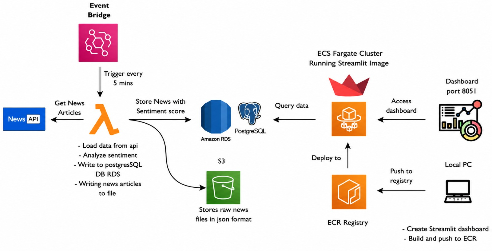

# 📰 AWS News Sentiment Analysis Pipeline

## 📌 Project Overview

This project is an end-to-end cloud-based **News Sentiment Analysis Pipeline** built using AWS services, Python, PostgreSQL, Docker, and Streamlit.

The pipeline automatically fetches live news articles from the News API, performs sentiment analysis on headlines, stores raw and processed data in AWS cloud services, and visualizes analytics through an interactive real-time dashboard.

---

# 🚀 Architecture Diagram



---

# ⚙️ Technologies Used

## 🐍 Programming & Frameworks

- Python
- Streamlit
- SQLAlchemy
- Pandas
- Plotly
- VADER Sentiment Analysis

---

## ☁️ AWS Services

- AWS Lambda
- Amazon EventBridge
- Amazon S3
- Amazon RDS PostgreSQL
- Amazon ECR
- Amazon ECS Fargate
- Amazon CloudWatch
- IAM


---

## 🐳 DevOps & Deployment

- Docker
- GitHub
- Amazon ECR
- Amazon ECS Fargate

---

# 📊 Features

- ✅ Automated News Ingestion
- ✅ Real-Time Sentiment Analysis
- ✅ AWS Lambda Serverless Processing
- ✅ EventBridge Scheduling Automation
- ✅ Raw JSON Storage in Amazon S3
- ✅ Processed Data Storage in PostgreSQL RDS
- ✅ Interactive Streamlit Dashboard
- ✅ Pie Charts & Bar Graph Analytics
- ✅ Dockerized Deployment
- ✅ ECS Fargate Hosting
- ✅ CloudWatch Monitoring
- ✅ Duplicate News Prevention

---

# 🔄 End-to-End Pipeline Flow

```text
News API
   ↓
AWS EventBridge
   ↓
AWS Lambda
   ↓
Sentiment Analysis
   ↓
Amazon S3 + PostgreSQL RDS
   ↓
Docker Container
   ↓
Amazon ECR
   ↓
Amazon ECS Fargate
   ↓
Streamlit Dashboard
`

---

# 📂 Project Structure

```text
news_sentiment_project/
│
├── LAMBDA_PROJECT/
│   ├── lambda_function.py
│   ├── requirements.txt
│   ├── modules/
│      ├── config.py
│      ├── database.py
│      ├── fetch_news.py
│      ├── s3_storage.py
│      └── sentiment_analysis.py
│
├── modules/
│   ├── database.py
│   ├── display.py
│   ├── fetch_news.py
│   ├── save_files.py 
│   └── sentiment_analysis.py
│
├── .dockerignore
├── .gitignore
├── app.py
├── architecture.jpeg
├── Dockerfile
├── main.py
├── README.md
└── requirements.txt
```

---

# 📈 Dashboard Features

* 📊 Sentiment Metrics Cards
* 🥧 Pie Chart Visualization
* 📉 Bar Chart Analytics
* 📄 Raw News Data Viewer
* 🎯 Sentiment Filtering
* 🔄 Auto Refresh Capability
* 🎨 Color Highlighted Sentiment Table

---

# 🛠️ Setup Instructions

## 1️⃣ Clone Repository

bash
git clone <YOUR_GITHUB_REPO_URL>
cd news_project


---

## 2️⃣ Install Dependencies

bash
pip install -r requirements.txt


---

## 3️⃣ Run Streamlit Dashboard

bash
streamlit run streamlit_app.py


---

# 🐳 Docker Commands

## Build Docker Image

bash
docker build -t news-dashboard .


## Run Docker Container

bash
docker run -p 8501:8501 news-dashboard


---

# ☁️ AWS Deployment

## AWS Services Integrated

* AWS Lambda for serverless ETL
* Amazon EventBridge for scheduling automation
* Amazon S3 for raw JSON storage
* Amazon RDS PostgreSQL for processed data
* Amazon ECR for container image storage
* Amazon ECS Fargate for dashboard hosting
* Amazon CloudWatch for monitoring and logs

---

# 🔒 Duplicate News Prevention

The PostgreSQL table uses a UNIQUE constraint on the news title to prevent duplicate article insertion during scheduled EventBridge runs.

---

# 📊 Dashboard Preview

The Streamlit dashboard provides:

* Real-time sentiment tracking
* Interactive visual analytics
* Historical news monitoring
* Sentiment distribution analysis

---

# ⭐ Project Status

* ✅ Completed End-to-End AWS Cloud Data Pipeline
* ✅ Production-Style Modular Architecture
* ✅ Automated & Event-Driven Workflow
* ✅ Cloud-Native Deployment Architecture

---

# 👩‍💻 Author

Devananda BB